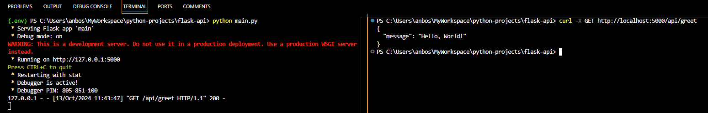

# flask-api

after cloning the repository

create a virtual env by running
python -m venv .venv

activate the virtual environment
.venv/scripts/activate

install flask
pip install flask

create a main.py

fianlly running the api

for opentelemetry setup

In PowerShell:

$env:OTEL_SERVICE_NAME = 'flask-api'
$env:OTEL_EXPORTER_OTLP_ENDPOINT = 'http://localhost:4317'
$env:OTEL_RESOURCE_ATTRIBUTES = 'deployment.environment=dev,service.version=1.0.0'
$env:SPLUNK_ACCESS_TOKEN='30ufQYyFvKA16EmVFWe5KA'
$env:OTEL_EXPORTER_OTLP_TRACES_PROTOCOL='http/protobuf'
$env:OTEL_EXPORTER_OTLP_TRACES_ENDPOINT='https://ingest.us1.signalfx.com/v2/trace/otlp'

to verify 

echo $env:OTEL_SERVICE_NAME
echo $env:OTEL_EXPORTER_OTLP_ENDPOINT
echo $env:OTEL_RESOURCE_ATTRIBUTES
echo $env:SPLUNK_ACCESS_TOKEN
echo $env:OTEL_EXPORTER_OTLP_TRACES_PROTOCOL
echo $env:OTEL_EXPORTER_OTLP_TRACES_ENDPOINT

SPLUNK_ACCESS_TOKEN=h9LOfZfAP4MHAFK4efA_Ug

# Check the registry key for environment variables
Get-ItemProperty -Path "HKLM:\SYSTEM\CurrentControlSet\Services\splunk-otel-collector" -Name Environment